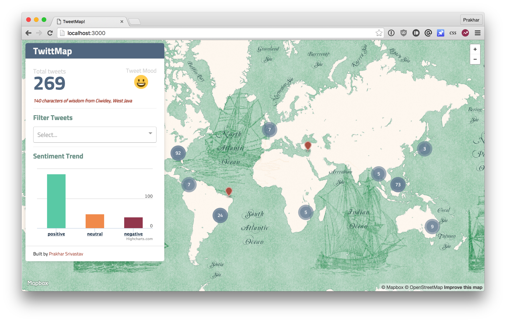
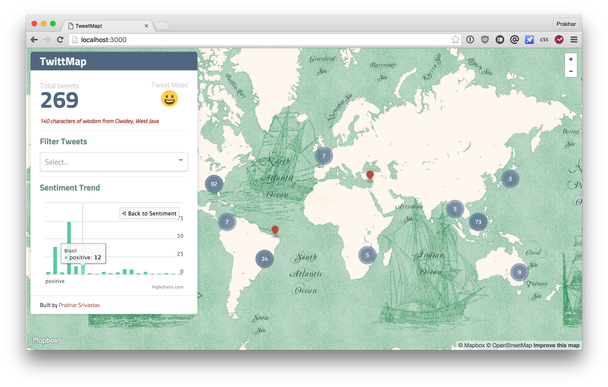

Tweets on SQS
===

### Assignment Objectives:

- Use the Amazon SQS service to create a processing queue for the Tweets that are delivered by the Twitter Streaming API

- Use Amazon SNS service to update the status processing on each tweet so the UI can refresh.

- Integrate a third party cloud service API into the Tweet processing flow.

#### Overview

For this assignment you will develop an application that:

- Reads a stream of tweets from the Twitter Live API (Code provided). Note: you might follow a specific topic on the API or get the complete stream
 
- Records the tweet ID, time, and other relevant elements into a DB (SQL or NoSQL) (2)

- After the tweet is recorded in the DB send a message to the Queue for Asynchronous processing on the text of the tweet (3)

- Presents the Tweet in a map that is being updated in Near Real Time (Consider evaluating WebSockets, or Server Side Events for your implementation)

- The map clusters tweets as to show where is people tweeting the most, according to the sample tweets you get from the streaming API.

- Define a worker pool that will pick up messages from the queue to process. These workers should each run on a separate pool thread.

- Make a call to the sentiment API off your preference (e.g. Alchemy). This can return a positive or negative sentiment evaluation for the text of the submitted Tweet. (4)

- As soon as the tweet is processed send a notification -using SNS- to an HTTP endpoint that will update the UI with the new information about the Tweet. (5)

- Using this information your application should display the Tweet clusters and the overall sentiment

### Shots!

### Tech

- Backend: Node.js (Express)
- Worker: Golang
- Frontend: React + HighCharts
- Streaming: Node.js
