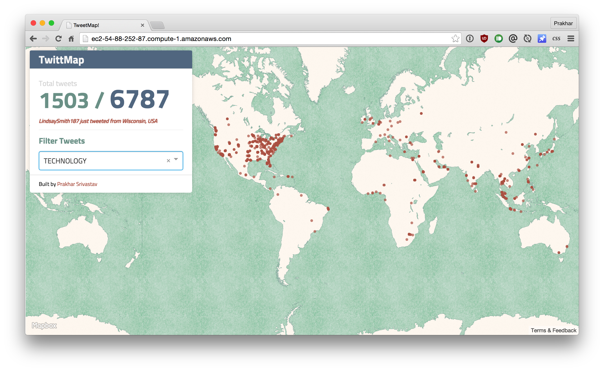

### TwittMap

- Get tweets from twitter and store it in DB (you can store only the ones that have the geo-location data to save time filtering the data later)
- Use Google Maps API to render these tweets in the map in whatever manner you want. You can visualize them as <dots>ther color maps,etc.
- You should provide a drop down with keywords of your choice to display only those tweets which contain the keyword.
- You need to display the tweets on the map in real-time. As new tweets come in, you need dynamically display them in the map without the need to press a button or refresh the page.
- The trending aspect of it is open ended.Last year some students implemented clustering algorithms on the tweets. You also show charts with statistics on each keyword in the  dropdown, using timestamp to show trends in different periods of time,e.t.c.  These are just some examples and if you come up with something fascinating, you will be awarded extra  credit.


### Prod

##### Stream
```
$ npm run stream
```

##### Start server
```
$ npm start
```

### Dev

##### Start server
```
$ npm run dev
```

##### Build frontend
```
$ npm run watch
```

